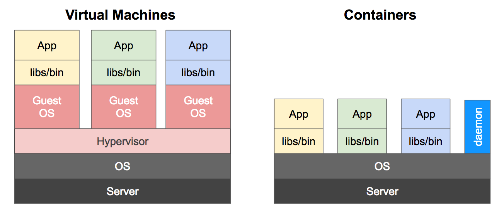
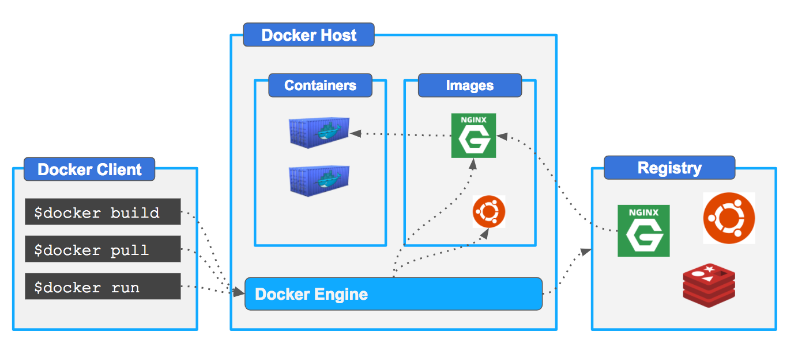

# Introduction

## A brief explanation of containers
An image is a lightweight, stand-alone, executable package that includes everything needed to run a piece of software, including the code, a runtime, libraries, environment variables, and config files.

A container is a runtime instance of an image—what the image becomes in memory when actually executed. It runs completely isolated from the host environment by default, only accessing host files and ports if configured to do so.

Containers run apps natively on the host machine’s kernel. They have better performance characteristics than virtual machines that only get virtual access to host resources through a hypervisor. Containers can get native access, each one running in a discrete process, taking no more memory than any other executable.

## Containers vs. virtual machines

Consider this diagram comparing virtual machines to containers:

 

Virtual machines run guest operating systems—note the OS layer in each box. This is resource intensive, and the resulting disk image and application state is an entanglement of OS settings, system-installed dependencies, OS security patches, and other easy-to-lose, hard-to-replicate ephemera.

Containers can share a single kernel, and the only information that needs to be in a container image is the executable and its package dependencies, which never need to be installed on the host system. These processes run like native processes, and you can manage them individually by running commands like docker ps—just like you would run ps on Linux to see active processes. Finally, because they contain all their dependencies, there is no configuration entanglement; a containerized app “runs anywhere.”

## Docker Platform

Docker is an  platform for developing, shipping, and running applications. Docker enables you to separate your applications from your infrastructure so you can deliver software quickly. With Docker, you can manage your infrastructure in the same ways you manage your applications. 

Docker provides a set of tools and applications to manage the lifecycle of your containers:

 

On the next sections we are going to be eploring most of them mostly focused on the day to day use of docker.

We are all set!  That's a wrap for the orientation so let's [move on to the next section](https://github.com/bitlogic/hello-docker/tree/master/1-running-containers)